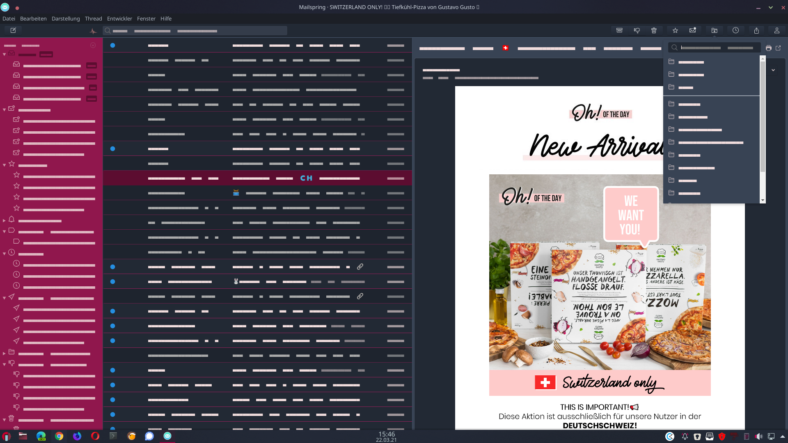

Theme for Mailspring with red and grey colors inspired by KDE Plasma Theme RED-DOT-BLACK

Summary 
📍 A fresher theme inspired by the KDE-Plasma Desktop Environment Theme Red-Dot-Black Theme
💻 Easy to install into Mailspring; 🎉 Open source 

How to install the theme into Mailspring 
1. Download the zip file by clicking on the green Clone or download button at the top right of the repo.
2. Unzip the file that was downloaded into one folder of your choise.
3. Open Mailspring
4. Open the Mailspring menu EDIT of Mailspring
5. Click on Install Theme. 
6. Find the downloaded Theme in your folder and click on it
7. Click the blue choose button and the theme will load
8. A Popup will shown up if you’re done 🎉

                                                                                 

License 
Licensed under the Mailsping-Theme-Starter by Foundry 376, LLC 
I hope you like the theme and share with some friends. 
https://github.com/hanny00?tab=repositories


Create your own Theme

# Mailspring Theme Starter (https://github.com/Foundry376/Mailspring-Theme-Starter)

The Mailspring Theme Starter is a basic starting point for creating a theme for
the [Mailspring](http://www.getmailspring.com/) email client.


## Getting Started

Creating a new theme in Mailspring is easy! Here's how you can do it.

1. Fork this repo or download the code. Add a name, display name, title, and
   description for your theme to `package.json`, and change the directory name
   to match.

2. Open Mailspring  and install the theme by going to `Mailspring > Install New Theme...`
   and selecting the directory.

3. Choose `Developer > Run With Debug Flags` for easier debugging.

4. Now, you can start playing with the theme! It's installed in
   `~/Library/Application Support/Mailspring/packages/THEME_NAME` (on macOS), so
   open it from there. Most of Mailspring's React components are derived from
   the core variables defined in `ui-variables.less`, and any changes you make
   there will override the defaults for Mailspring. You can also add more LESS
   files in `styles` (ideally, separated into logical components like
   `thread-list.less`) to make your own specific changes. To reload the theme,
   just open the console (`Developer > Toggle Developer Tools`) and type

   ```
   AppEnv.themes.setActiveTheme('ui-light');
   AppEnv.themes.setActiveTheme('your-theme-name');
   ```

5. Once you're happy with your theme, check how it looks in the theme picker
   (`Mailspring > Change Theme...`). We use your UI variables to pull the
   colors, but if you want to add your own selections to the color palette,
   create a `theme-colors.less` file that includes any of the variables that you
   want to change, and they'll only affect the theme preview. Here are the
   variables, on the left, with the part of the theme preview that they match:

   ```
   @background-secondary:     BACKGROUND_COLOR
   @text-color:               TEXT_COLOR, FIRST_SWATCH_COLOR
   @component-active-color:   MIDDLE_SWATCH_COLOR
   @toolbar-background-color: LAST_SWATCH_COLOR
   @panel-background-color:   STRIP_COLOR
   ```

## Structure

```
.
├── styles                 # All stylesheets
|   ├── index.less             # Main LESS file to import your stylesheets
│   ├── ui-variables.less  # UI variables that override N1's defaults
│   ├── theme-colors.less  # Theme colors for theme preview (optional)
├── package.json           # Metadata about the theme
├── LICENSE.md             # License with usage rights
└── README.md              # Info about your theme and how to use it
```
